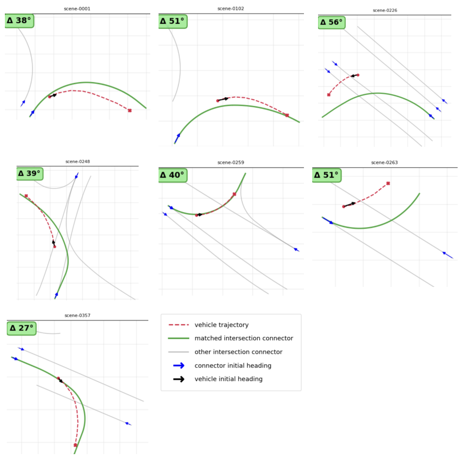
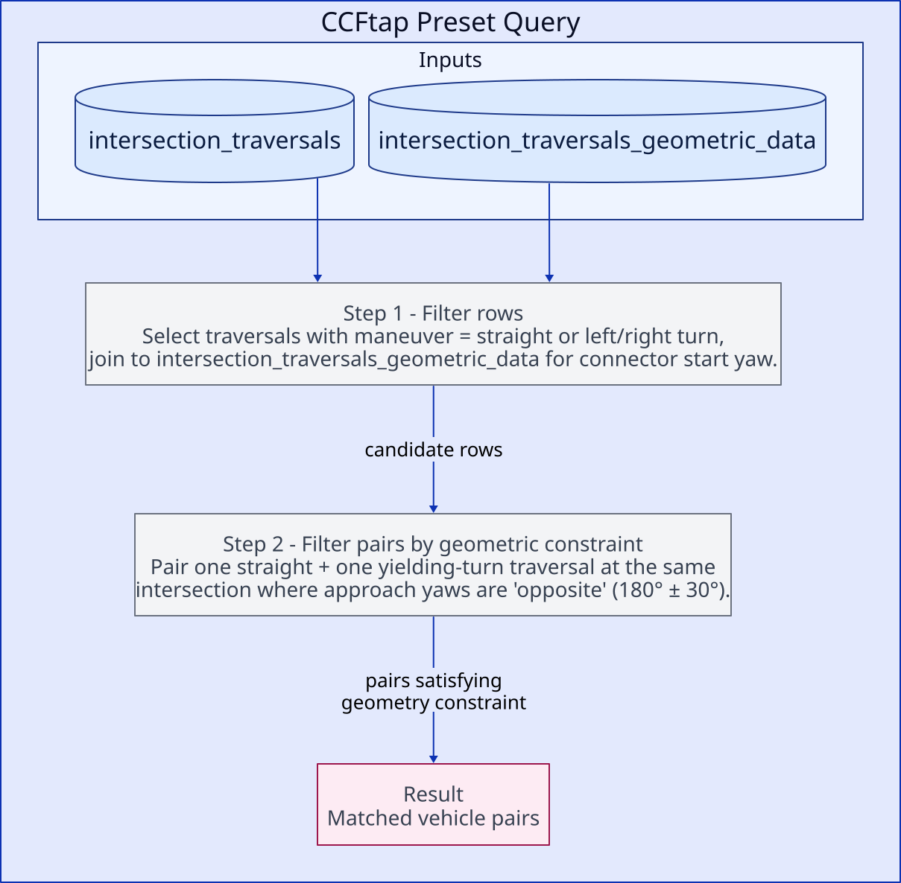
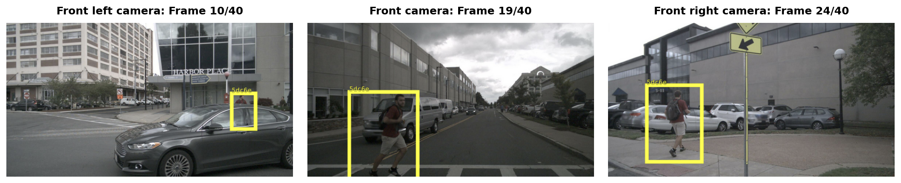
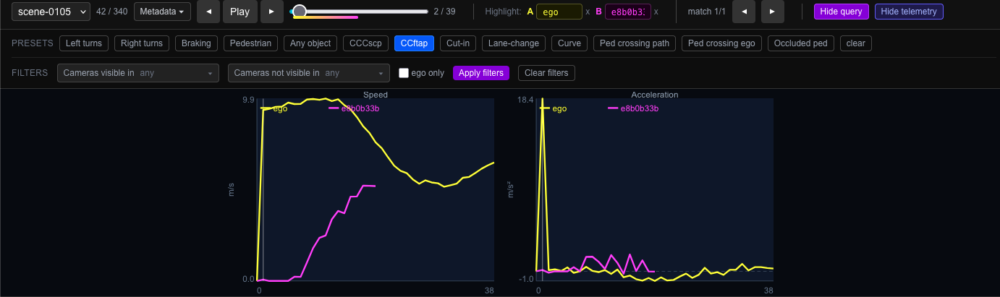
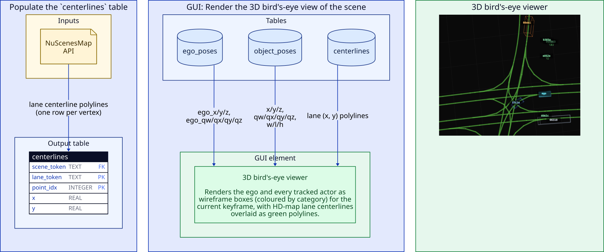
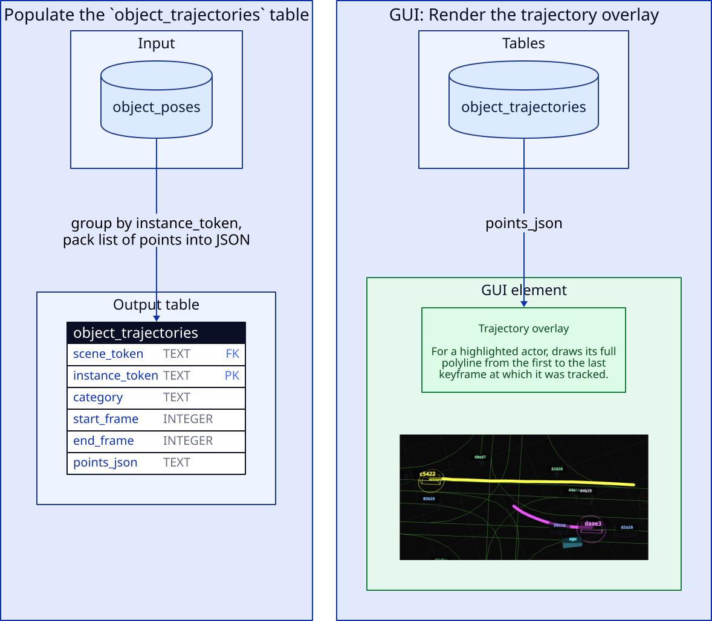
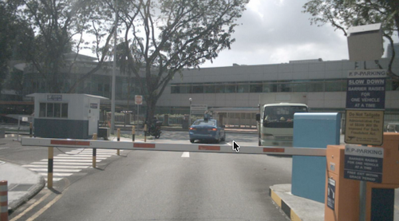
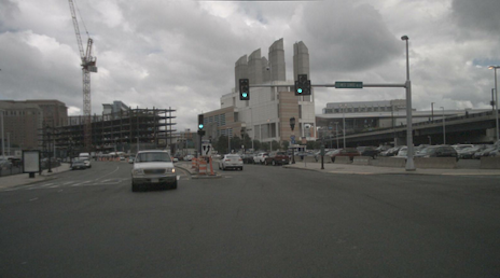

\begin{titlepage}
\centering
\vspace*{\fill}
{\huge\bfseries DriverQ: A Scenario Query and Visualization Tool for Autonomous Driving Data\par}
\vspace{2cm}

{\Large Barry Zhang\par}
\vspace{0.5cm}

{\large Supervisor: Dr. Krzysztof Czarnecki\par}
\vspace{1.5cm}

{\large ECE 499 - Engineering Project\par}
{\large Department of Electrical and Computer Engineering\par}
{\large University of Waterloo\par}
\vspace{0.3cm}
{\large April 2026\par}

\vspace*{\fill}
\end{titlepage}

\newpage

## Summary

This report presents DriverQ, a query, analytics, and visualization tool for the nuScenes autonomous driving dataset. The tool enables engineers to query for specific driving scenario types (such as cut-in events, pedestrian crossings, and turning conflicts) and inspect matching scenes in an interactive 3D viewer with synchronized camera feeds. The system consists of a Python exporter pipeline that extracts nuScenes data into a SQLite database, a REST API server that executes parameterized scenario queries, and a React/Three.js frontend for visualization. Scenario detection combines SQL-based candidate retrieval with rule-based kinematic and geometric post-processing. The kinematic movement classifier adapts the Ayres et al. (2004) yaw-rate-based algorithm for nuScenes' 2 Hz sample rate, while multi-vehicle scenarios like crossing conflicts leverage the nuScenes HD map's _lane connector_ geometry. The tool supports 11 preset scenarios (including lane changes, CCFtap, pedestrian crossings) with configurable filters for location, camera visibility, and actor scope, providing a practical implementation of targeted scenario querying for autonomous driving development.

The public repo is available at [https://github.com/bluebarryz/DriverQ](https://github.com/bluebarryz/DriverQ).

## Table of Contents

1. [Introduction and Motivation](#1-introduction-and-motivation)
    - 1.1 [Project Overview](#11-project-overview)
    - 1.2 [Motivation](#12-motivation)
2. [Related Work](#2-related-work)
    - 2.1 [Tesla Data Engine](#21-tesla-data-engine)
    - 2.2 [Ayres Vehicle Movement Classification](#22-ayres-vehicle-movement-classification)
3. [System Architecture and Methodology](#3-system-architecture-and-methodology)
    - 3.1 [System Overview](#31-system-overview)
    - 3.2 [Data Extraction and Schema](#32-data-extraction-and-schema)
        - 3.2.1 ["Foundational" data tables](#321-foundational-data-tables)
        - 3.2.2 ["Event" tables](#322-event-tables)
        - 3.2.3 [`cutin_events` and `kinematic_features` tables](#323-cutin_events-and-kinematic_features-tables)
        - 3.2.4 [`intersection_traversals` and `intersection_traversals_geometric_data` tables](#324-intersection_traversals-and-intersection_traversals_geometric_data-tables)
        - 3.2.5 [Other Event Tables: `lane_change_events` and `ped_vehicle_crossings`](#325-other-event-tables-lane_change_events-and-ped_vehicle_crossings)
        - 3.2.6 [Other Preset Scenario Queries](#326-other-preset-scenario-queries)
        - 3.2.7 [A Note on Specificity vs Generalizability of Data Tables](#327-a-note-on-specificity-vs-generalizability-of-data-tables)
    - 3.3 [Frontend and Visualization](#33-frontend-and-visualization)
    - 3.4 [Database Tables Supporting the UI Rendering](#34-database-tables-supporting-the-ui-rendering)
        - 3.4.1 [3D Bird's Eye Viewer](#341-3d-birds-eye-viewer)
        - 3.4.2 [Actor Trajectory Polyline Highlighting](#342-actor-trajectory-polyline-highlighting)
        - 3.4.3 [Six-camera Panel with Bounding Boxes and Visibility Level Labels](#343-six-camera-panel-with-bounding-boxes-and-visibility-level-labels)
    - 3.5 [Technology Stack](#35-technology-stack)
4. [Results](#4-results)
    - 4.1 [Detection Counts](#41-detection-counts)
    - 4.2 [Use Case: VLM VQA Test Case Collection](#42-use-case-vlm-vqa-test-case-collection)
5. [Conclusions and Recommendations](#5-conclusions-and-recommendations)
    - 5.1 [Summary](#51-summary)
    - 5.2 [Limitations](#52-limitations)
    - 5.3 [Future Work](#53-future-work)
6. [References](#6-references)
7. [Appendix A: Applying Ayres' algorithm to detect turns](#appendix-a-applying-ayres-algorithm-to-detect-turns)
8. [Appendix B: Matching a trajectory to a lane connector](#appendix-b-matching-a-trajectory-to-a-lane-connector)

\newpage
## 1. Introduction and Motivation

### 1.1 Project Overview

DriverQ is a search and visualization tool for the nuScenes autonomous driving dataset [\[1\]](#ref1). Engineers describe a driving scenario type, for example, "cut-in events," "left turns," or "occluded pedestrian crossings", and the tool finds matching scenes, highlights the relevant actors and frames, and renders the results in a 3D bird's-eye viewer with synchronized six-camera feeds.

The system is composed of three stages. First, a Python exporter pipeline uses the nuScenes SDK to extract raw dataset contents (including vehicle/actor poses, lane geometry, and camera bounding box coordinates) into a SQLite database. Second, a REST API server accepts parameterized queries and executes scenario detection logic against the database. Third, a React frontend built with Three.js renders query results in an interactive 3D viewer. All scenario detection follows a two-stage pattern: SQL queries retrieve plausible candidates from indexed tables, then Python post-processing applies temporal, geometric, or kinematic constraints if necessary to return robust matches.

### 1.2 Motivation

Autonomous driving systems (ADS) rely on deep learning models whose performance is fundamentally constrained by training data quality and coverage. As described in Andrej Karpathy's patent on targeted data collection for autonomous driving [\[2\]](#ref2), "significant resources are invested in collecting, curating, and annotating the training data," and "it is often difficult to collect data for particular use cases that a machine learning model needs improvement on." When a model underperforms on a specific scenario class, e.g. vehicles cutting into the ego lane, or pedestrians crossing from behind occluding objects, engineers need a way to retrieve additional examples of that exact class from available driving data. This targeted retrieval is the "curate" stage of the data flywheel: query for underrepresented scenarios, augment the training set, retrain the model, and redeploy.

Beyond training data curation, scenario-based approaches are also critical for ADS validation. Menzel et al. [\[3\]](#ref3) argue that distance-based validation i.e. driving enough miles to demonstrate statistical safety is not economically viable for higher automation levels. The alternative is scenario-based testing, where engineers identify, parameterize, and validate specific operating scenarios. For example, rather than trying to demonstrate safety by simply driving more miles, a team can enumerate a concrete scenario such as "unprotected left turn across oncoming traffic at a signalized intersection" and then validate the system's behavior across parameterized variants of that scenario (different oncoming speeds, gap sizes, lighting conditions, occluding vehicles). This is analogous to unit testing and test coverage in traditional software engineering: each scenario plays the role of a unit test asserting correct behavior under a specific, well-defined input condition, and the collection of scenarios constitutes a coverage map over the system's operational design domain. Just as a developer would not ship a library on the basis of aggregate runtime alone without unit tests exercising its edge cases, an ADS cannot be validated by fleet mileage alone without targeted scenarios exercising its known-hard cases. With DriverQ, one can query for such scenarios from real-world data.

Salay and Czarnecki [\[4\]](#ref4) formalize this need in the context of ISO 26262 adaptation for machine learning: training and validation datasets must have sufficient coverage of the input domain, conditioned by risk. High-risk scenarios such as near-collision events or occluded pedestrian crossings must be adequately represented. This demands input domain partitioning tools that can check whether specific scenario types exist in a dataset and quantify coverage gaps.

DriverQ addresses these needs by providing a practical, end-to-end pipeline for targeted scenario querying. Engineers can query for specific scenario classes across the nuScenes dataset, inspect matching instances with full 3D and camera context, and audit scenario coverage. This supports both training data curation and scenario-based testing workflows.

## 2. Related Work

### 2.1 Tesla Data Engine

Andrej Karpathy's patent "System and Method for Obtaining Training Data" [\[2\]](#ref2) describes a closed-loop system for iterative model improvement in autonomous driving. The system identifies difficult or underrepresented cases from deployed vehicle data, curates additional training examples of those cases, retrains the model, and redeploys. The patent identifies the core bottleneck: without sufficient training examples of specific hard cases, the model may not be accurate enough to be usable. The proposed solution is a targeted collection loop where scenarios are mined from fleet data based on model performance gaps.

To make this loop scale to a broad and open-ended set of scenarios, Tesla's approach uses general-purpose learned classifiers. The patent describes triggering data collection through a variety of "trigger classifiers" that operate on sensor data, vehicle telemetry, or intermediate model outputs. These classifiers are described as small or shallow neural networks, support vector machines, etc. Each classifier is trained to recognize a particular condition of interest (for example, an unprotected left turn, a specific weather condition, or a perception confidence dropout) and runs onboard the vehicle to flag candidate examples for upload. The benefit of this generalized, learned approach is that adding a new scenario type amounts to training a new lightweight classifier rather than designing new detection logic from scratch.

DriverQ takes a different approach: it targets a smaller, fixed subset of scenarios (including turns, cut-ins, lane changes, pedestrian crossings, occluded pedestrian crossings, and intersection crossing conflicts) and detects each one through hand-crafted rule-based logic that combines SQL filters, kinematic thresholds, and HD map geometry. This approach is narrower in scope than Tesla's, but it remains useful for several reasons. First, rules are inspectable and adjustable: each detection threshold corresponds to a meaningful physical quantity (e.g. lateral offset in meters, heading change in degrees, acceleration in $m/s^2$), so an engineer can read the detection logic, understand why a given scene matched, and adjust thresholds without retraining. The rules use concrete features from the data such as vehicle telemetry and map data instead of intermediate outputs from a model. Second, we avoid the overhead of training models, as collecting enough labeled training data can be a major barrier. Third, the project operates over the publicly available nuScenes dataset, making it directly usable by researchers, students, and small teams without access to a deployed fleet or intermediate outputs of an autonomous driving model.

### 2.2 Ayres Vehicle Movement Classification

Ayres et al. [\[5\]](#ref5) developed a threshold-based algorithm for classifying vehicle movements from onboard kinematic sensor data. Working with yaw rate and forward speed signals from a single instrumented vehicle, the algorithm detects steering events via yaw-rate threshold excursions, computes kinematic features (heading change, lateral displacement, radius of curvature), and classifies each event as a turn, curve, or lane change through a sequential cascade of threshold tests. 

DriverQ adapts the Ayres algorithm as a method for identifying when the vehicle turned (Section 3.5 and [Appendix A](#appendix-a-applying-ayres-algorithm-to-detect-turns)). However, the project goes beyond Ayres' scope in several important ways. In particular, it adds HD map context provided by nuScenes: coordinates of lanes, coordinates of _lane connectors_ (the polylines connecting a road intersection's incoming and outgoing lanes), and the polygons outlining road intersections. This data enables classification and queries involving road intersections, which involves information unavailable from kinematics alone. As a result, this project is able to detect multi-vehicle scenarios (intersection crossing conflicts, cut-ins) that require reasoning about the spatial and temporal relationships between __multiple__ vehicles.

## 3. System Architecture and Methodology

### 3.1 System Overview

The system consists of a data pipeline and an interactive query, visualization, and analytics application.

The data pipeline is implemented as a sequence of Python export scripts. Each stage reads from the nuScenes dataset via its official Python SDK [\[7\]](#ref7) and writes relevant data to a shared SQLite database. The steps are exlained in section 3.2.

The query application consists of a REST API server that accepts queries and returns matching scenes with highlighted actors and frame windows. The application also has a React/Three.js frontend that renders results in an interactive 3D viewer.

### 3.2 Data Extraction and Schema

### 3.2.1 "Foundational" data tables

The SQLite database organizes extracted data into tables. These tables contain the data needed for rendering the scenes in the UI and for querying scenarios. The following are the "foundational", "core" tables used downstream:

- `scene`: Contains basic metadata for a scene (e.g. name "scene-0101", scene token, location, etc).
- `object_poses`: Contains the (x, y, z) coordinates and (qw, qx, qy, qz) orientation for each non-ego actor at every frame, in every scene. 
- `ego_poses`: Same as `object_poses` but for the ego vehicle in every scene.

See Figure 1 for the data flow. Data is read from the [nuScenes devkit](https://github.com/nutonomy/nuscenes-devkit/blob/master/python-sdk/tutorials/nuscenes_tutorial.ipynb) JSON tables via the Python SDK [\[7\]](#ref7) (denoted by the yellow 'Input' boxes in the figure) and used to populate our SQLite database tables. This way, we store exactly the data we need, and we can retrieve it later (for rendering GUI elements, executing queries, or populating other SQLite tables) without invoking the nuScenes SDK again.

### 3.2.2 "Event" tables
The "event" tables contain data essential for querying specific scenarios/events, and they are derived from the "foundational" tables and/or the nuScenes devkit via the SDK. 

### 3.2.3 `cutin_events` and `kinematic_features` tables

{ width=70% }

`kinematic_features` (Figure 2, left panel) caches per-frame ego-relative kinematics for every actor. For each (scene, frame, actor) triple it stores: the actor's global heading `yaw`, `speed`, longitudinal offset `s_rel_ego` and lateral offset `l_rel_ego` expressed in the Frenet coordinate frame [\[8\]](#ref8). `s_rel_ego` is the signed distance of the vehicle along the ego's heading direction and `l_rel_ego` is the perpendicular lateral displacementof the vehicle relative to the ego computed by rotating the world-frame position delta `(x - ego_x, y - ego_y)` into the ego's heading frame. We also store `perpendicular_displacement`, which for each actor measures its perpendicular displacement relative to its own heading since the previous frame.

A cut-in event is when a vehicle moves laterally from an adjacent lane into the ego vehicle's lane while remaining ahead. The detector slides a window over each non-ego vehicle's `l_rel_ego` series and flags it as a cut-in when: `|l_rel_ego|` starts at $\geq 2.5$ m (i.e. vehicle is laterally far enough from ego that it is not in the same lane) and decreases almost-monotonically to $\leq 1.2$ m (i.e. vehicle is close enough laterally to plausibly be in ego's lane). `s_rel_ego` stays in $[1, 30]$ meters throughout i.e. the non-ego vehicle has to be longitudinally ahead of the ego for the event to be considered a cut-in. We also require the vehicle's heading aligns with the ego's at the end of the window (i.e. require the ego and other vehicle's headings differ by $< 30^\circ$). Finally, to avoid spurious cut-ins caused by the ego switching into the lane of another vehicle ahead of it, we require that the lateral motion is attributed to the non-ego vehicle rather than the ego. We do this by comparing the `perpendicular_displacement` magnitudes and yaw changes between the two vehicles. Figure 2 (right panel) shows how the `cutin_events` table is populated from the `kinematic_features` table.

### 3.2.4 `intersection_traversals` and `intersection_traversals_geometric_data` tables

`intersection_traversals_geometric_data` (Figure 3, left panel) records each time any vehicle (including ego) drives through an intersection. We determine this using the nuScenes devkit by checking whether the vehicle's pose overlaps with a road intersection polygon. For each traversal we match the vehicle's in-intersection trajectory to the HD-map lane connector it most closely followed, storing the connector's start heading (`connector_1_start_yaw`) and its geometric classification (`connector_1_classification`: left/right/straight) in the `intersection_traversals_geometric_data` table. The connector start heading is needed for multi-vehicle queries that require us to know the heading of the vehicles when they enter the intersection.

**What a _lane connector_ is**:  _lane connectors_ come from the nuScenes HD map. A _lane connector_ is a polyline inside a road intersection that connects one of the intersection's incoming lanes to one of its outgoing lanes - it traces the path a vehicle would take to get from the incoming lane, through the intersection, and onto the outgoing lane. Every feasible way of traversing the intersection (straight through, turning left, turning right) corresponds to a distinct _lane connector_.

Figure 4 shows vehicle trajectories for turn events in various scenes from the dataset. As the legend indicates, the red dashed line is the trajectory of the vehicle while it was in the intersection. The grey lines are _lane connectors_, and the green line is the best-matching _lane connector_ for that vehicle's trajectory. The blue arrow at the start of the _lane connectors_ indicates the initial heading of the lane connector (we get this data directly from the nuScenes annotations), and it indicates the angle at which the vehicle would approach the intersection if it traversed on that _lane connector_. The black arrow at the start of the vehicle's trajectory is the average heading (across the first 3 points of its trajectory) of the vehicle. 

The delta angle in the green box in the top-left corner of each plot is the difference in angle between the blue arrow (the matched connector's start heading) and the black arrow (the heading computed from the vehicle's first few trajectory points). As explained earlier, the quantity we actually want is the vehicle's heading *when it entered the intersection*. In several of the plots the vehicle's trajectory starts part-way inside the intersection; nuScenes only records the vehicle once it becomes visible to the ego, which is sometimes after it has already rounded the corner. Thus, the black-arrow heading points along the vehicle's mid-turn direction rather than along its pre-intersection approach. The blue arrow, by contrast, is fixed to the intersection's map geometry regardless of where the trajectory happens to start, which is why we use it as the vehicle's approach heading.

**Matching a trajectory to a _lane connector_**: Given a vehicle's in-intersection trajectory and the set of _lane connectors_ in that intersection, we score each candidate connector against the trajectory and keep the one with the lowest score. The full scoring and alignment procedure is described in [Appendix B](#appendix-b-matching-a-trajectory-to-a-lane-connector).

The `intersection_traversals` table (Figure 3, right panel) assigns a final maneuver label (`left`, `right`, `straight`, or `curve`) to each traversal. `left` and `right` denote turn maneuvers, `straight` denotes traversals where the vehicle went straight through the intersection, and `curve` denote traversals where the vehicle went through the intersection along a curved road but did not turn. Two signals are used to determine which maneuver a traversal should be classified as. First, Ayres' yaw-rate [\[5\]](#ref5) is applied to the kinematic window (from `kinematic_features`, buffered by 3 frames before/after the intersection): sustained yaw rate above threshold with $\geq 30^\circ$ total heading change imply a left or right turn, while smaller heading change imply a curved road (but not a turn). Second, the connector classification from `intersection_traversals_geometric_data` is used as a fallback when Ayres fires no event, and as a tie-breaker to resolve ambiguous `curve` labels into left/right when the connector match is confident. See [Appendix A](#appendix-a-applying-ayres-algorithm-to-detect-turns) for more details on how Ayres' algorithm is applied, including the specific thresholds retuned for nuScenes' 2 Hz keyframe rate.

{ width=75% }

**CCFtap scenario query:** One of the key use cases of DriverQ is querying for the **CCFtap** (Car to Car Front turn across path) scenario [\[8\]](#ref8), where a turning vehicle crosses the path of an oncoming through-vehicle (e.g. a left-turning vehicle turning across the path of oncoming straight-through traffic). Figure 5 shows how this query works in the backend. First, we query our `intersection_traversals` SQL table for straight maneuvers and left/right maneuvers, joined with `intersection_traversals_geometric_data` to get the start yaw of the lane connector used in the maneuver; this gives us the angle at which the vehicle entered the intersection. This is needed because for CCFtap we need to determine that the vehicles approached the intersections from opposite directions. We then apply a post-processing step on the candidates that pair a "straight" vehicle with a turning vehicle and checks that the two vehicles approached the intersection from "opposite" legs of the intersection.

### 3.2.5 Other Event Tables: `lane_change_events` and `ped_vehicle_crossings`
We also populate event tables for storing lane change events and pedestrian-vehicle crossing events (i.e. when a pedestrian crosses the path of a vehicle).

We populate an intermediate table called `lane_connectivity` (Figure 6, left panel) using data provided by the nuScenes Map API, and we use this table, along with the foundational `ego_poses` and `object_poses` tables to detect lane change events by ego and non-ego vehicles, populating the events in `lane_change_events` (Figure 6, right panel).

{ width=60% }

We populate the `ped_vehicle_crossings` table (Figure 7) by determining whether the vehicle and pedestrian trajectories intersect during the scene. Or, in the case that a pedestrian crosses in front of a stopped vehicle, we check whether their trajectories intersect within a close enough distance.

Using the `ped_vehicle_crossings`, we can query for pedestrian crossing scenarios in the UI via the 'Ped crossing path' preset query.

**Occluded pedestrian crossing**: This is another preset query that extends the pedestrian crossing preset query by analyzing the pedestrian's camera visibility trajectory across the three front-facing cameras. The algorithm requires the pedestrian to traverse all three cameras in a monotonic direction (e.g., right-to-left: first visible in the front-right camera, last visible in the front-left camera). During the entry phase (from first appearance in the entry camera to last appearance in that camera ) the number of frames with low visibility (nuScenes visibility annotation indicating 0-60% visible, stored in the `visibility` table) is counted. A minimum number of low-visibility frames (default: 1) is required, indicating the pedestrian was at least partially occluded during approach.

In Figure 8, we see an example of a pedestrian crossing in front of the ego, moving from the front left camera (frame 10 shown) to the front camera (frame 19 shown) to the front right camera (frame 24 shown). We see that the pedestrian was occluded for 1 frame (frame 10).

### 3.2.6 Other Preset Scenario Queries
**Braking**: The braking preset identifies significant deceleration events. It reads each vehicle's **speed** and **acceleration** directly from the pose data: `speed` and `acccel` from the `ego_poses`/`object_poses` table, so no dedicated event table for braking events is needed.

### 3.2.7 A Note on Specificity vs Generalizability of Data Tables

The event tables in Sections 3.2.3-3.2.5 all exist to *cache* the output of an expensive detector so that each query becomes a filter over pre-computed rows rather than a fresh pass over raw poses. How narrow or wide the cache should be is a tradeoff between specificity and generalizability. Complex, one-off detectors get a table tailored to a single scenario e.g. `cutin_events` and `lane_events` hold cut-ins and lane changes with columns that only make sense in that context, and `ped_vehicle_crossings` is similarly shaped around one type of query. Simpler, more "atomic" maneuvers (like turns) get a more general table: `intersection_traversals` just records each traversal as left / right / straight, which is enough for the preset queries for turns, CCFtap, and CCCscp presets to all share without duplicating detection work. The rule is: if only one preset will ever consume the output, build a specific table; if several preset queries will reason about the same labelling, make a general table and let each preset query layer its own logic on top.

### 3.3 Frontend and Visualization

The frontend is a React application providing an interactive 3D scene viewer, a six-camera panel, and a query interface.

The 3D viewer renders a bird's-eye view of each scene using Three.js. The vehicles and pedestrian are drawn as wireframe boxes coloured by category. Lane centerlines from the HD map are overlaid as green polylines. Playback advances at 5 frames per second with manual scrubbing. Two highlight slots allow users to select objects of interest: highlighted objects receive coloured outlines and trajectory overlays, while non-highlighted objects fade to low opacity.

![DriverQ UI - 1. Select the query to execute, 2. Use drop down to select which matched scene to view, 3. Toggle through all scenario matches in this scene (all occurrences of CCFtap, in this case). The vehicle(s) involved in the match are highlighted in yellow/purple, and you can change which vehicles are highlighted in the boxes to the left of the match toggle, 4. Drag the slider to view a particular frame in the scene. The yellow/purple bar below the slider indicates the range of frames during which the selected match occurs, 5. Apply additional filters to the query (e.g. select which camera(s) the scenario can or cannot appear in), 6. View the highlighted vehicle (purple bounding box) in the cameras and visibility level (%), 7. Telemetry toggle to view the ego and highlighted vehicles' speed and acceleration charts during the scene](report_images/ui.png)

The query panel provides a preset selector (2nd row from the top) with various scenario types and configurable filters. When a query executes, the scene list filters to matching scenes only. A match navigator in the top toolbar allows cycling through matches within each scene, automatically jumping to the relevant frame and highlighting the matched actors.

The camera panel displays all six ego-mounted cameras with 2D bounding box overlays from the visibility data. An expanded view shows detailed visibility information (provided by the NuScenes annotations) for all objects in a single camera.

A telemetry chart (Figure 10) displays speed and acceleration over time for the ego vehicle and any highlighted tracks, with a cursor synchronized to the current frame.

### 3.4 Database tables supporting the UI rendering
### 3.4.1 3D Bird's Eye Viewer

Figure 11 shows how the data flows from the nuScenes Map API and our SQLite tables to our React app, enabling it to render a 3D bird's eye view of the lane centerlines and wireframe boxes of the actors. First, a `centerlines` SQLite table is populated using the nuScenes Map API. This table, along with the `ego_poses` and `object_poses` tables are queried when rendering the 3D BEV for a scene.

### 3.4.2 Actor Trajectory Polyline Highlighting

{ width=70% }

Figure 12 shows the data flow that enables the GUI to render a highlighted polyline for the vehicles' full trajectory during the scene. We populate an `object_trajectories` SQLite table that uses the `object_poses`/`ego_poses` tables and stores the vehicle's complete list of points as a JSON string, which is retrieved when rendering the highlights.

### 3.4.3 Six-camera Panel with Bounding Boxes and Visibility Level Labels

Figure 13 shows the data flow that enables the GUI to render the 6 camera views with bonding boxes and visibility levels.

### 3.5 Technology Stack

DriverQ uses a modular full-stack architecture with separate components for data extraction from nuScenes, backend query serving, and interactive visualization.

**Data pipelines**: The extraction and feature-generation pipelines are implemented in Python. Core dependencies include the nuScenes devkit for dataset and HD map access, NumPy and pandas for numerical processing, and SQLite (via Python's built-in `sqlite3` module).

**Web server**: The backend is a Python REST service built with FastAPI and served with Uvicorn. It executes parameterized SQL queries against SQLite, applies scenario-specific post-processing logic in Python, and returns responses for scene matches.

**UI and web app**: The frontend is a React application written in TypeScript. Three.js powers the 3D bird's-eye scene rendering, while standard web APIs and React state management handle playback, camera view synchronization, and query interactions.

## 4. Results

### 4.1 Detection Counts

The following table summarizes detection counts across the 340-scene nuScenes subset loaded into the database. For each preset we report the total number of detections and the number of scenes (out of 340) in which at least one detection was found.

| Preset | Detections | Scenes with $\geq 1$ detection (of 340) |
|---|---|---|
| Left turns | 277 | 146 |
| Right turns | 301 | 164 |
| Curves | 516 | 211 |
| Cut-in | 9 | 8 |
| Lane change | 69 | 58 |
| Pedestrian crossing | 1444 | 135 |
| Occluded pedestrian | 17 | 12 |
| Braking | 252 | 124 |
| CCFtap | 159 | 41 |
| CCCscp | 45 | 8 |

**Observations.** The counts reveal a clear spectrum of scenario rarity. Turns and curves are common (277-516 detections, present in about half the scenes), while cut-ins (9) and occluded pedestrian crossings (17) are genuinely rare events - well below what random scene browsing would surface. CCFtap (159 in 41 scenes, ~4 matches per scene) is moderately common but spatially concentrated: a small number of intersection-heavy scenes account for most matches. CCCscp is even more concentrated, with 45 detections clustered across only 8 scenes.

**Manual search difficulty.** DriverQ reduces manual search for scenarios, replacing what would otherwise require watching a significant amount of video footage. The difficulty of that manual task varies considerably by scenario type. Turns and pedestrian crossings are relatively easy to spot manually by watching video. Cut-ins are much harder: they require tracking the lateral trajectory of a specific vehicle relative to the ego across multiple frames. They are also relatively are in the nuScenes dataset. CCFtap is perhaps hardest to identify manually: a reviewer would need to identify an intersection event, locate opposing traffic, and confirm that one vehicle turns across the other's path. This would be without the HD-map geometry that the tool leverages automatically. Occluded pedestrian crossings are practically impossible to find at scale manually, since they require tracking a pedestrian's per-frame camera visibility across all three front cameras simultaneously.

**Precision and recall.** Without ground-truth labels it is difficult to formally evaluate recall. Rule-based detectors like this one tend to favor precision over recall: thresholds are chosen conservatively, so the system only fires when evidence is strong. For CCFtap, the main known sources of false negatives are: (1) traversals excluded because connector matching failed and `connector_1_start_yaw` is NULL, (2) genuine opposing-approach pairs that fall just outside the $\pm 30^\circ$ `opposite_approach` tolerance due to skewed intersection geometry; and (3) turning vehicles whose kinematic event is classified as `curve` rather than `left`/`right`, which excludes them from the turning role.

### 4.2 Use Case: VLM VQA Test Case Collection

As a practical application, the tool was used by researchers from the [WISE Lab](https://uwaterloo.ca/waterloo-intelligent-systems-engineering-lab/) at the University of Waterloo to collect test cases for vision-language model (VLM) visual question answering (VQA) evaluation. Scenario queries identified specific driving situations (e.g. pedestrian crossings, cut-in events, turning conflicts, braking events) and the corresponding camera images were extracted. These frame-level image-question pairs served as structured test inputs for evaluating whether a VLM can correctly identify and reason about the depicted driving scenario when fed questions related to causality, counterfactual analysis, and intent prediction. Using DriverQ, the researches found over 70 scenarios in the nuScenes dataset to use as VQA test case examples.

**Examples:**

For example, the frame in Figure 14 is from a scene found by querying for ego braking events. We can pair this frame with VQA questions like "Why did the vehicle stop?" or "What would happen if the vehicle kept driving without stopping?"

{ width=70% }

As another example (Figure 15), for this frame we could ask an intent prediction question like "What is the oncoming vehicle trying to do?" 

The scene for this example was found by querying for CCFtap scenarios where the turning vehicle was visible in the ego's front camera. This once again illustrates how DriverQ can facillitate fast querying for useful scenarios.

{ width=70% }

## 5. Conclusions and Recommendations

### 5.1 Summary

This project presents DriverQ, a tool for scenario-specific querying, analysis, and visualization of autonomous driving data. The system extracts nuScenes data into a structured database, detects driving scenarios through a combination of kinematic analysis (adapted from Ayres et al.) and HD map geometry, and presents results in an interactive 3D viewer with camera evidence. The tool supports over 11 different scenario presets covering single-vehicle maneuvers, multi-vehicle conflicts, and pedestrian interactions.

Key technical contributions include the dual-system approach to scenario detection: kinematic classifiers determine vehicle behavior from motion signals, while map-based classifiers provide the spatial context needed for multi-vehicle relational reasoning. Neither system alone is sufficient for complex scenarios like crossing conflicts, but their combination enables detections that would be impossible with either approach in isolation. Another key contribution was the encoding of driving scenes into a relational database (SQLite) to enable structured, efficient querying for defined scenarios.

### 5.2 Limitations

**Sample rate**: The nuScenes dataset provides annotations at 2 Hz, significantly lower than the 10 Hz data used in the original Ayres work. This necessitated threshold adjustments and limits the temporal resolution of event detection. Rapid maneuvers shorter than 0.5 seconds may be missed.

**Frenet approximation**: The ego-heading-based coordinate decomposition assumes locally straight roads. On curves, this introduces systematic bias in lateral offset estimates, which can produce false positive cut-in detections.

**Threshold sensitivity**: All detection logic uses hand-tuned thresholds and rules. Might not generalize across all road and intersection layouts.

### 5.3 Future Work

**Learned classifiers**: Replacing or augmenting hand-tuned thresholds with learned models trained on labeled scenario examples could improve both precision and recall.

**Additional scenario types**: The framework is extensible to further scenario types such as merges, roundabout maneuvers, and near-miss events with more refined TTC analysis. Creating a domain-specific language (DSL) for querying may also be considered.

**Dataset generalization**: Adapting the exporter pipeline to work with other annotated driving datasets (Waymo Open, Argoverse) would increase the available scenario pool and enable cross-dataset coverage analysis.

\newpage

## 6. References

[]{#ref1} [1] H. Caesar, V. Bankiti, A. H. Lang, S. Vora, V. E. Liong, Q. Xu, A. Krishnan, Y. Pan, G. Baldan, and O. Beijbom, "nuScenes: A multimodal dataset for autonomous driving," arXiv preprint arXiv:1903.11027, 2019.

[]{#ref2} [2] A. Karpathy, "System and Method for Obtaining Training Data," U.S. Patent Application US 2021/0271259 A1, Tesla, Inc., 2021.

[]{#ref3} [3] T. Menzel, G. Bagschik, and M. Maurer, "Scenarios for Development, Test and Validation of Automated Vehicles," arXiv:1801.08598, 2018.

[]{#ref4} [4] R. Salay and K. Czarnecki, "Using Machine Learning Safely in Automotive Software: An Assessment and Adaption of Software Process Requirements in ISO 26262," WISE Lab, University of Waterloo, 2018.

[]{#ref5} [5] G. Ayres, B. Wilson, and J. LeBlanc, "Method for Identifying Vehicle Movements for Analysis of Field Operational Test Data," *Transportation Research Record*, no. 1886, pp. 92-100, 2004.

[]{#ref6} [6] Euro NCAP, "Euro NCAP Protocol - Crash Avoidance - Frontal Collisions Version 1.1," Euro NCAP, Oct. 2025. Protocol document, implementation January 2026. [Online]. Available: https://cdn.euroncap.com/cars/assets/euro_ncap_protocol_crash_avoidance_frontal_collisions_v11_bc661b4bdc.pdf

[]{#ref7} [7] nuTonomy, "nuscenes-devkit: The devkit of the nuScenes dataset," GitHub repository, https://github.com/nutonomy/nuscenes-devkit.

[]{#ref8} [8] M. Werling, J. Ziegler, S. Kammel, and S. Thrun, "Optimal Trajectory Generation for Dynamic Street Scenarios in a Frenet Frame," in *Proc. IEEE International Conference on Robotics and Automation (ICRA)*, 2010.

\newpage
## Appendix A: Applying Ayres' algorithm to detect turns

The inputs are the heading $\psi$ and speed $V$ of every vehicle at every keyframe, both of which are already stored in `kinematic_features`. The detector runs on those two signals alone, no map, no labels, and emits a list of steering events that it then classifies.

*Step 1: yaw-rate signal.* For each pair of consecutive frames we compute the yaw rate

$$\dot\psi_i = \frac{\psi_i - \psi_{i-1}}{t_i - t_{i-1}}$$

and smooth the resulting series with a 3-frame moving average. Ayres smooths with a 1-second window at 10 Hz; 3 samples at nuScenes' 2 Hz keyframe rate span the same ~1.5 s.

*Step 2: event windows.* Any frame where the smoothed yaw rate exceeds a threshold (1°/s, lifted from Ayres' 0.4°/s to tolerate the noisier low-rate signal) marks a candidate steering event. The window is then extended in both directions out to the nearest zero crossing of the smoothed rate, so a single turn manoeuvre becomes one contiguous window rather than a run of per-frame triggers.

*Step 3: per-event features.* Inside each window we compute, from the unsmoothed signal:

- **heading change** $\Delta\psi = \sum_k (\psi_k - \psi_{k-1})$: the net change in heading from the first to the last frame of the event;
- **peak yaw rate** $\dot\psi_\text{peak} = \max_k |\dot\psi_k|$;
- **speed at peak** $V_\text{peak}$;
- **radius of curvature at peak**, from the steady-state circular-motion relation

$$R = \frac{V_\text{peak}}{|\dot\psi_\text{peak}|}$$

*Step 4: classification.* The event is run through Ayres' cascade, mildly retuned for 2 Hz:

- If $|\Delta\psi| < 5°$ the event is discarded as noise (Ayres uses 3° at 10 Hz).
- It is classified as a **turn** if $|\Delta\psi| \geq 30°$ *and* the motion is sharp on at least one axis: either a high peak yaw rate at low speed ($\dot\psi_\text{peak} > 11.5°/s$ while $V_\text{peak} < 8$ m/s), or a tight turning circle ($R < 50$ m, vs. Ayres' 42 m). A minimum $V_\text{peak} \geq 2$ m/s rejects in-place rotations that don't exist in Ayres' single-vehicle stream.
- Everything else is a **curve**.

The sign of $\Delta\psi$ splits a turn into **left** (positive) or **right** (negative).

\newpage
## Appendix B: Matching a trajectory to a lane connector

Given a vehicle's in-intersection trajectory (the series of `(x, y)` points the vehicle occupied while inside the intersection polygon) and the set of _lane connectors_ that live inside that intersection, we want the single connector whose centerline the trajectory most closely hugs. We score each candidate connector against the trajectory and pick the one with the lowest score. The score is the sum of two penalties:

$$S_c = \underbrace{\frac{1}{N}\sum_{i=1}^{N} \lVert p_i - q_i^{(c)} \rVert}_{\text{mean positional distance}} \; + \; \underbrace{\bigl|\,\theta_\text{traj} - \theta_c\,\bigr|}_{\text{heading error}}$$

Here $p_1, \dots, p_N$ are the trajectory points, $\theta_\text{traj}$ is the heading of the overall vector from the first to the last trajectory point, and $\theta_c$ is the corresponding overall heading of the portion of connector $c$ that we matched against.

The second term is easy: it penalises a candidate connector whose overall direction disagrees with the direction the vehicle actually travelled, so a connector traversed "backwards" can't win even if it happens to pass near the trajectory.

The first term is where the work is. For each candidate connector $c$ we need a point $q_i^{(c)}$ on the connector's centerline that is the "right" point to compare against $p_i$. We get it in two steps:

1. **Find where the trajectory entered the connector**: We project the very first trajectory point $p_1$ onto the connector's centerline, giving an arc-length offset $s_0$ along the connector. This is our best guess at where along the connector the vehicle began its traversal.
2. **March along in lockstep**: We also compute the cumulative along-path distance the trajectory walked: $d_i = \sum_{j=2}^{i} \lVert p_j - p_{j-1} \rVert$. Then $q_i^{(c)}$ is defined as the point on the connector's centerline at arc length $s_0 + d_i$ i.e., "the place on the connector a vehicle that perfectly followed the connector would have reached by the time the real vehicle had travelled a distance $d_i$".

If the trajectory is actually following connector $c$, each $p_i$ ends up very close to its paired $q_i^{(c)}$ and the mean distance is small. If the trajectory belongs to a different connector in the intersection, the pairs diverge and the mean distance grows rapidly, so that candidate loses. The connector with the lowest combined score $S_c$ is recorded as the matched connector for this traversal.
